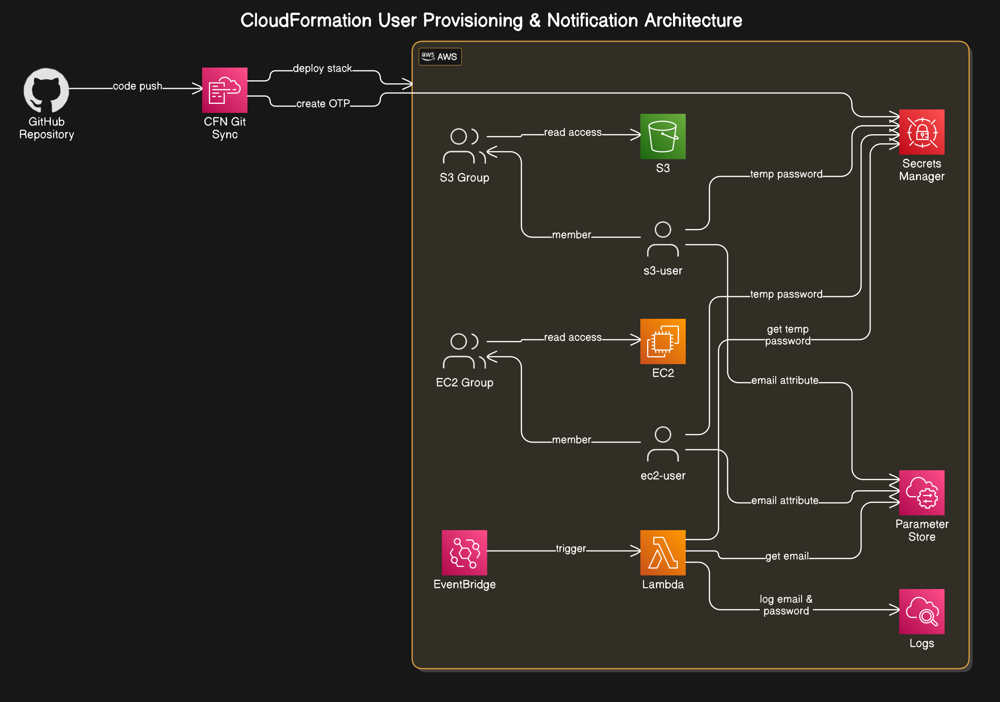

# IAM User Creation Automation with Lambda and CloudWatch

## Overview


This CloudFormation template automates the creation of IAM resources for two users: one with access to S3 (`s3-user`) and another with access to EC2 (`ec2-user`). It also configures a Lambda function to log the creation events and retrieve relevant information such as temporary passwords and user emails stored in AWS Secrets Manager and AWS Systems Manager (SSM).



## Features

- **IAM Users Creation**: Creates two IAM users (`s3-user` and `ec2-user`) with respective read-only access to S3 and EC2.
- **Temporary Password**: A temporary password is generated and stored in AWS Secrets Manager.
- **Lambda Logging**: A Lambda function logs the creation of IAM users and fetches associated secrets (passwords) and parameters (emails).
- **CloudWatch Events**: A CloudWatch Events rule triggers the Lambda function on the creation of IAM users.
- **SSM Parameters**: Stores user email addresses in AWS Systems Manager (SSM) for `s3-user` and `ec2-user`.

## CloudFormation Template

### Parameters

- **S3UserEmail**: The email address of the S3 user.
- **EC2UserEmail**: The email address of the EC2 user.

### Resources

- **TemporaryPassword**: A secret containing a temporary password for all IAM users.
- **S3ReadGroup**: An IAM group that grants read-only access to S3.
- **EC2ReadGroup**: An IAM group that grants read-only access to EC2.
- **S3User**: An IAM user with read-only access to S3.
- **EC2User**: An IAM user with read-only access to EC2.
- **S3UserEmailParam**: An SSM parameter storing the email address for the S3 user.
- **EC2UserEmailParam**: An SSM parameter storing the email address for the EC2 user.
- **LambdaExecutionRole**: An IAM role that grants the Lambda function the necessary permissions to interact with CloudWatch, Secrets Manager, and SSM.
- **UserCreationLogger**: A Lambda function that logs the creation of IAM users and retrieves secrets and parameters.
- **UserCreationEventRule**: A CloudWatch Events rule that triggers the Lambda function upon the creation of an IAM user.
- **LambdaInvokePermission**: Permissions that allow CloudWatch Events to invoke the Lambda function.

### Outputs

- **S3UserARN**: The ARN of the S3 user.
- **EC2UserARN**: The ARN of the EC2 user.
- **TemporaryPasswordSecret**: The ARN of the Secrets Manager secret containing the temporary password.

## IAMUserCreationLoggerHandler Lambda Function

The Lambda function `IAMUserCreationLoggerHandler` logs the creation of IAM users and retrieves associated information such as the user’s email and temporary password.

### Code:

```java
public class IAMUserCreationLoggerHandler implements RequestHandler<Map<String, Object>, String> {

  private final SecretsManagerClient secretsClient;
  private final SsmClient ssmClient;

  public IAMUserCreationLoggerHandler() {
    this.secretsClient = SecretsManagerClient.create();
    this.ssmClient = SsmClient.create();
  }

  @SuppressWarnings("unchecked")
  @Override
  public String handleRequest(Map<String, Object> event, Context context) {
    LambdaLogger logger = context.getLogger();

    try {
      Map<String, Object> detail = (Map<String, Object>) event.get("detail");
      Map<String, Object> requestParams = (Map<String, Object>) detail.get("requestParameters");
      String userName = (String) requestParams.get("userName");

      logger.log("Processing creation of user: " + userName);

      String secretName = "iam-users-temporary-password";

      GetSecretValueRequest secretRequest =
          GetSecretValueRequest.builder().secretId(secretName).build();

      GetSecretValueResponse secretResponse = secretsClient.getSecretValue(secretRequest);
      String password = secretResponse.secretString();

      String paramName = "/iam/users/" + userName + "/email";
      GetParameterRequest paramRequest = GetParameterRequest.builder().name(paramName).build();

      GetParameterResponse paramResponse = ssmClient.getParameter(paramRequest);
      String email = paramResponse.parameter().value();

      logger.log(String.format("New IAM User Created - Username: %s", userName));
      logger.log(String.format("Email: %s", email));
      logger.log("Temporary password: [REDACTED]");

      System.out.println(
          String.format(
              "OUTPUT - Username: %s, Email: %s, Temp Password: %s", userName, email, password));

      return "Successfully logged IAM user creation";

    } catch (Exception e) {
      logger.log("Error processing IAM user creation event: " + e.getMessage());
      e.printStackTrace();
      throw new RuntimeException("Failed to process IAM user creation", e);
    }
  }
}
```

## Lambda Execution Role Permissions

The Lambda function requires permissions to interact with CloudWatch, Secrets Manager, and Systems Manager. The execution role provides the necessary permissions for logging and retrieving secrets/parameters.

## CloudWatch Events Rule

This rule triggers the `IAMUserCreationLogger` Lambda function when a new IAM user is created. It listens for `CreateUser` events from AWS CloudTrail, which are generated when a new IAM user is created.

